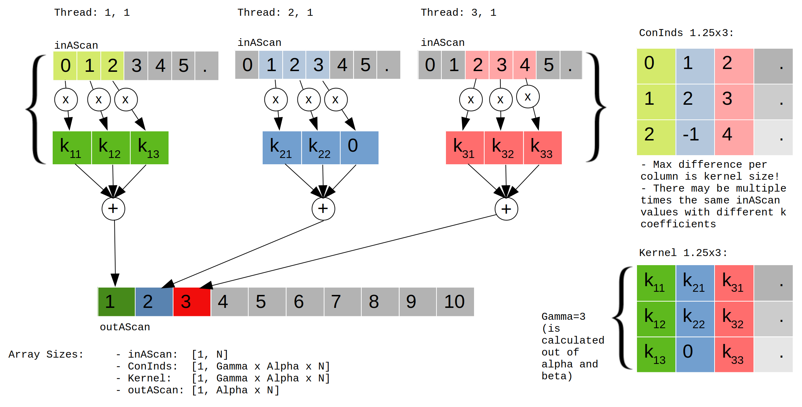

# OCT-Processing: CUDA Library Documentation
___

## Dependencies / Installation

### Ubuntu/Kubuntu
* Ensure to purge everything already installed on the system
    * Show already installed nvidia things: apt list --installed |grep nvidia
    * Purge all the already installed nvidia stuff that wasn't installed automatically: sudo apt purge XXX
    * Remove all the automatically installed libraries: sudo apt autoremove 
* Install latest Nvidia drivers if the system has a Nvidia graphics card.
    * sudo apt install nvidia-driver-418
* Install latest Nvidia CUDA toolkit if the system has a Nvidia graphics card.
    * sudo apt install nvidia-cuda-dev nvidia-cuda-toolkit
    * evtl. install profiling tools: sudo apt install nvidia-profiler nvidia-visual-profiler

### Windows
* Install latest Nvidia drivers if the system has a Nvidia graphics card.
    * Get actual driver from Nvidia and pray it works: https://www.nvidia.de/Download/index.aspx?lang=de
* Install latest Nvidia CUDA toolkit if the system has a Nvidia graphics card.
    * Get the latest CUDA toolkit from here: https://developer.nvidia.com/cuda-toolkit
* Install the OpenCL driver from: https://software.intel.com/en-us/articles/opencl-drivers#cpu-section     

___

## Content of this Project

* C API to access CUDA-OCT-Processing
* Cuda Kernels needed to do the OCT-Processing
* Utility functions to readout runtime errors.

### Implemented Kernels

#### PreFFTProcess

**Kernel Prototype:**
~~~~
__global__ void preFFTProcess(OctGPUParams params, OctIOdata ioData);
~~~~

**Kernel Arguments:**

|Memory Type| Data Type | Name | Description |
|---|---|---|---|
| register | OctGPUParams | params | Struct containing all the information needed by the kernel. |
| register | OctIOdata | ioData | Struct containing all the pointers to the buffers. |

**Kernel usage:**
~~~~
preFFTProcess<<<dimGrid,dimBlock,smSize,*ioData.stream>>>( params , ioData);
~~~~

#### PostFFTProcess

**Kernel Prototype:**
~~~~
__global__ void postFFTProcess(OctGPUParams params, OctIOdata ioData, float scaling);
~~~~

**Kernel Arguments**

|Memory Type| Data Type | Name | Description |
|---|---|---|---|
| register | OctGPUParams | params | Struct containing all the information needed by the kernel. |
| register | OctIOdata | ioData | Struct containing all the pointers to the buffers. |
| register | float | scaling | Scaling factor of iFFT. |

**Kernal usage:**
~~~~
postFFTProcess<<<dimGrid, dimBlock, 0, *ioData.stream>>>(params, ioData, 1.0f/(float)params.nbrOfSamplesAScanTemp);
~~~~

#### byPassFFT

**Kernel Prototype:**
~~~~
__global__ void byPassFFT(OctGPUParams params, OctIOdata ioData, float scaling);
~~~~

**Kernel Arguments**

|Memory Type| Data Type | Name | Description |
|---|---|---|---|
| register | OctGPUParams | params | Struct containing all the information needed by the kernel. |
| register | OctIOdata | ioData | Struct containing all the pointers to the buffers. |
| register | float | scaling | Scaling factor of iFFT. |

**Kernal usage:**
~~~~
byPassFFT<<<dimGrid,dimBlock,0,*ioData.stream>>>(params, ioData, scaling);
~~~~
___


## Algorithm implementation

 
### Processing steps overview 
 
The used general scheme to process the image data is the "output data decomposition" scheme. This scheme is explained here: https://www-users.cs.umn.edu/~karypis/parbook/Lectures/AG/chap3_slides.pdf 
 
 
1. Create processing block size and create the grid 
2. Copy the raw B-Scan data from the host computer memory to the gpu global memory. 
3. Copy the the input data needed to calculate the processing of a whole block into the shared memory. 
4. Remove the previous recorded background vector. 
5. Filter out the DC part of the signal with a moving average filter of size 25. 
6. Apply the spectral shaping algorithm. 
7. Do the remapping 
8. Apply the Hann window. 
9. Compensate the dispersion through applying a compensation function. 
10. Copy the processed block data back from the shared memory to the global memory of the gpu. 
11. Execute the iFFT function. 
12. Apply Scaling of iFFT and convert the complext value to a real value. 
13. If all blocks of a B-Scan finished processing, copy the whole processed B-Scan data back to the computer memory. 
 

### Block and Grid Size Considerations

There are some Hardware limitations that influences the block as well as the grid dimensions.

Limitations:
*  2048 Max. resident threads per streaming multiprocessor
*  8 Max. resident blocks per streaming multiprocessor
*  64 Max. resident warps per streaming multiprocessor
*  48kB maximal shared memory size (This means 23 Bytes/Thread or 6kbyte/block)

Optimization criteria:
* Utilize all of the 2048 available threads
* Maximize block size to padding ratio
* Utilize memory coalescing.

The memory coalescing and the padding ratio resulted into the decision to use 1x256 row-vectors to do the processing.

| Specification               |Formula                                         |Calculation                    |  Result        |  
|-----------------------------|------------------------------------------------|-------------------------------|----------------|
| Shared memory per block:    | 2 * 4 * (BlockSize * alpha + 2 * dcKernelSize) | 2 * 4 * (256 * 1.25 + 2 * 25) |**2.96kbytes**  |
| Number of blocks:           | BScanSize/BlockSize                            | (512*1024) / 256              |**2048**        |               
| Number of warps per block:  | BlockSize / WarpSize                           | 256 / 32                      |**8**           |            
| Number of resident warps:   | WarpsPerBlock * BlocksPerSM                    | 8 * 8                         |**64**          |                                      
| Number of resident threads: | NumberOfResidentWarps * WarpSize               | 64 * 32                       |**2048**        |                                         
| Number of blocks per A-Scan:| AScanSize * Alpha / BlockSize                  | 1024 * 1.25 / 256             |**5**           |

### Shared memory Considerations

The chosen data partitioning scheme "Output Data Decomposition" creates one parallel task per output element. In the OCT-Processing, due to the remap, multiple input elements are necessary to calculate one output element. Most input elements are even used multiple times for different output elements. As the shared memory isn't big enough and the copy effort would be enormous to store the whole A-Scan inside the shared memory the algorithm has to identify the portion of input data it really needs to calculate all the output elements of one block.
This was achieved by dividing the remap indices vector into as many parts as there are blocks per output A-Scan. Then these parts were searched for the start and end indices for each block. The biggest difference of this two indices defines how big the portion of the input data copied to the shared memory is. All the start indices were stored inside a vector and handed over to the kernel. Now the kernel knows through it's block ID where to start coping the input data to the shared memory. The following image tries to visualize this.


* The smStartInds vector is the vector storing all the start indices used to copy the input data to the shared memory.
* inAScan is the input data vector
* outAScan is the output data vector
* All the colored elements are the parts that belong to one block per color. They visualize the different parts copied to the shared memory. There are also some brighter elements for each color. Those visualize the padded elements used to generate valid values with the DC removing kernel.

### Background removal

The Background removal is the subtraction of a previous recorded A-Scan that was stored to the
global memory of the GPU. This processing step simply builds the element wise difference between the new input
data and the stored vector for each row.

### DC Removal

As the NUFFT remaping method delivers better results for a clean analog signal it is important to remove the DC
part of the input signal. This is achieved with subtracting the moving-average filtered signal from itself. This results
in a very simple kind of high-pass filter. The mathematical formulation of the moving-average filter can be seen in the following equeation.

```math
S_{fk} = S_k - \frac{1}{n}\sum_{i=k-\frac{n}{2}}^{k+\frac{n}{2}}S_i
```

|||
|---|---|
| $`S_{fk}`$: | Filtered Value at position k |
| $`S_k`$: | Unfiltered value at position k |
| $`S_i`$: | Unfiltered value at position i |
| $`k`$: | Position in vector where to apply the filter |
| $`n`$: | Kernel size of the filter (must be odd)|
| $`i`$: | index variable for kernel |


### Spectral Shaping

The spectral shaping improves the image by normalizing it.

```math
S_{k} = S_k * \frac{\sum_{i=0}^{n-1}S_i}{S_k}
```

|||
|---|---|
| $`S_{k}`$: | Value at position k |
| $`k`$: | Position in vector where to apply the filter |
| $`n`$: | Size of the A-Scan |
| $`i`$: | index variable |

### NUFFT Remap

The remaping is basically a interpolation and re-sampling of the data set. This must be done because the measured signal is not linear in k-space. The following image shows a typical remaping step. The 3 orange values are used to calculate the blue one.


The implementation of the problem above is shown in the next image.



In a new system one have to measure the so called remap vector. For the following considerations it's assumed that this remap vector is already existing.
Out of the remap vector one can generate two matrices. In the first matrix each column stores all the indices of the input vector needed to calculate one new output element. The second matrix stores the corresponding coefficients.

### Hann Windowing

As the measured data consists of a finite number of data points for an A-Scan the FFT will introduce artifacts.
These can be minimized by windowing the measured data. This means that the measurements near the edges are
weighted less than the ones in the center. This algorithm implements a Hann window.

```math
S_{k} = \frac{1}{2} \left[sin\left( \frac{2\pi}{n-1} k + \frac{3\pi}{2}\right)+1\right]
```

|||
|---|---|
| $`S_{k}`$: | Value at position k |
| $`k`$: | Position in vector where to apply the filter |
| $`n`$: | Size of the A-Scan |

### Dispersion Compensation

The resulting interference signal of the OCT measurement method results from the two different paths the light takes. One, is the sample path and the other is the reference path. As those two components are built by different optical elements, they do induce different chromatic dispersion. This means that the paths for different wave length may not be completely the same length. This can be correctet with the following calculation.

```math
S_{k_{real}} = cos(\varphi)
```
```math
S_{k_{imag}} = sin(\varphi)
```
```math
\varphi_{k} = \sum_{i_2}^{4} \left[a_i\left(-0.5+\frac{S_k}{n-1} \right)^i\right]
```

|||
|---|---|
| $`S_{k}`$: | Value at position k |
| $`S_{k_{real}}`$: | Real value at position k |
| $`S_{k_{imag}}`$: | Imaginary value at position k |
| $`\varphi_{k}`$: | Complex angle at position k |
| $`k`$: | Position in vector |
| $`i`$: | Indices variable for coefficients |
| $`n`$: | Size of the A-Scan |
| $`a_i`$: | Coefficient i |


### iFFT
To retreave the relative position of the reflecting layers out of the interference signal a inverse Fourier transformation is used. This is called a transformation from frequency domain (FD) to spatial domain (SD).

### iFFT scaling
As the implementation of the Fourier transformation does not implement the scaling factor it is implemented separately.

### Convert complex number to a real one
In the last step the complex value is converted to a real one. This is achieved by calculating the length of the complex vector.

```math
S_{k} = \sqrt{S_{k_{real}}^2+S_{k_{imag}}^2}
```
|||
|---|---|
| $`S_{k}`$: | Value at position k |
| $`S_{k_{real}}`$: | Real value at position k |
| $`S_{k_{imag}}`$: | Imaginary value at position k |

___

## Error Checking Function

Error checking is only enable in Debug built type. The makros together with the inline functions ensure no time is lost in Release mode.
There are 3 makros. One for API functions, one for functions out of the cufft library and one to use inside the kernels.

**cuda_errorchecking.h:**
```
#define CudaSafeAPICall( err ) __cudaSafeCall( err, __FILE__, __LINE__ )
#define CudaSafeFFTCall( res ) __cudaSafeFFTCall( res, __FILE__, __LINE__ )
#define CudaCheckKernelError()    __cudaCheckError( __FILE__, __LINE__ )

inline void __cudaSafeCall( cudaError err, const char *file, const int line )
{
#ifdef MODULE_CUDA_DEBUG
    if ( cudaSuccess != err )
    {
        fprintf( stderr, "CudaSafeAPICall() failed at %s:%i : %s\n",
                 file, line, cudaGetErrorString( err ) );
        exit( -1 );
    }
#endif

    return;
}

inline void __cudaSafeFFTCall( cufftResult res, const char *file, const int line )
{
#ifdef MODULE_CUDA_DEBUG
    if ( CUFFT_SUCCESS != res )
    {
        fprintf( stderr, "CudaSafeFFTCall() failed at %s:%i\n",
                 file, line);
        exit( -1 );
    }
#endif

    return;
}

inline void __cudaCheckError( const char *file, const int line )
{
#ifdef MODULE_CUDA_DEBUG
    cudaError err = cudaGetLastError();
    if ( cudaSuccess != err )
    {
        fprintf( stderr, "CudaCheckKernelError() failed at %s:%i : %s\n",
                 file, line, cudaGetErrorString( err ) );
        exit( -1 );
    }

    // More careful checking. However, this will affect performance.
    // Comment away if needed.
    err = cudaDeviceSynchronize();
    if( cudaSuccess != err )
    {
        fprintf( stderr, "cudaCheckError() with sync failed at %s:%i : %s\n",
                 file, line, cudaGetErrorString( err ) );
        exit( -1 );
    }
#endif

    return;
}
```

___

## Performance Analysis

For performance analysis Nvidia provides its cli profiling tool and a separate visualization software.

### Installation: 
**sudo apt install nvidia-profiler nvidia-visual-profiler**

### Important Commands 
**nvprof --analysis-metrics -fo NameOfAnalysis.nvprof ./executable**
**nvvp &** (Import->nvprof->multi...->NameOfAnalysis.nvprof)
___


